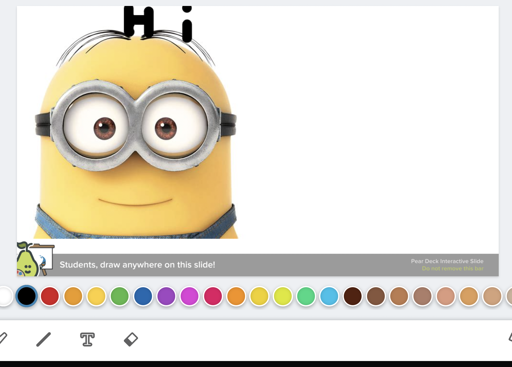

# peardeck-image-plugin
Script that allows you to upload full resolution images while in a peardeck draw-prompt, and have it render the image on the prompt.

## Usage

1. Join a peardeck
2. When on a "Canvas Drawing" prompt screen, paste `./script.js` into your DevTools console.
3. Insert an image URL into the prompt that pops up
4. Reload the page and voila

---

License information has been put into `./LICENSE`

> THE SOFTWARE IS PROVIDED "AS IS", WITHOUT WARRANTY OF ANY KIND, EXPRESS OR
IMPLIED, INCLUDING BUT NOT LIMITED TO THE WARRANTIES OF MERCHANTABILITY,
FITNESS FOR A PARTICULAR PURPOSE AND NONINFRINGEMENT. IN NO EVENT SHALL THE
AUTHORS OR COPYRIGHT HOLDERS BE LIABLE FOR ANY CLAIM, DAMAGES OR OTHER
LIABILITY, WHETHER IN AN ACTION OF CONTRACT, TORT OR OTHERWISE, ARISING FROM,
OUT OF OR IN CONNECTION WITH THE SOFTWARE OR THE USE OR OTHER DEALINGS IN THE
SOFTWARE.
